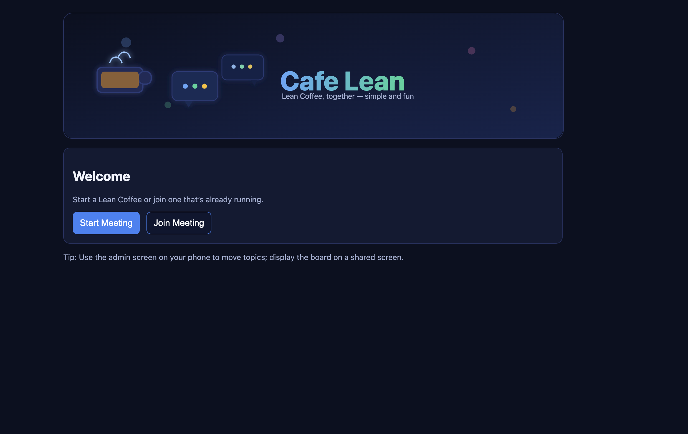
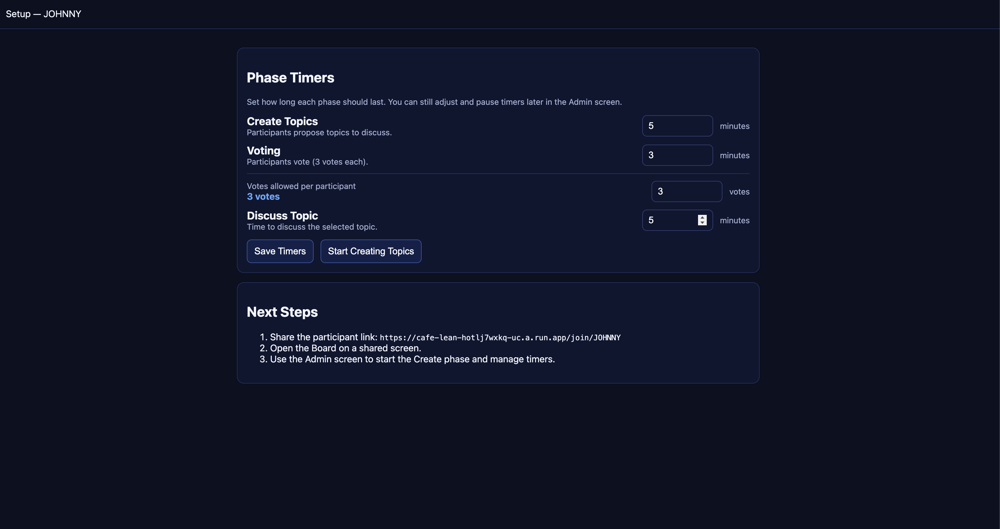
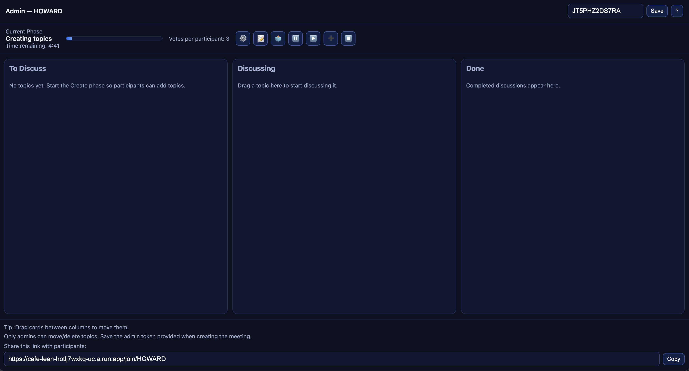
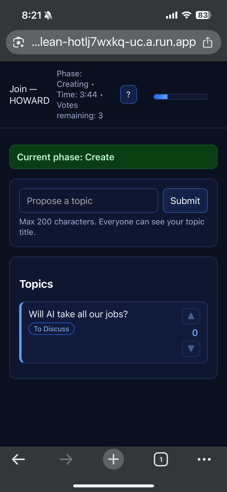

# Cafe Lean — Lean Coffee Webapp - Testing

A minimal Lean Coffee board with a shared display, admin controls, and participant voting.

## Screenshots
<table>
  <tr>
    <td width="50%">
      
      <div><sub>Participants enter a meeting and add topics.</sub></div>
    </td>
    <td width="50%">
      
      <div><sub>Facilitators configure timers and limits before the session starts.</sub></div>
    </td>
  </tr>
  <tr>
    <td>
      
      <div><sub>Admin board shows live voting tallies and lets you advance phases.</sub></div>
    </td>
    <td>
      
      <div><sub>Shared display keeps everyone aligned on the active discussion.</sub></div>
    </td>
  </tr>
</table>
<div align="center">

<sup>Each card shows how participants submit topics, facilitators manage phases, and the board updates in real time.</sup>

</div>

## Run with Docker

- Build image:
  - `docker build -t cafe-lean .`
- Run container:
  - `docker run --rm -p 3000:3000 -e MAX_VOTES=3 --name cafe-lean cafe-lean`
- Open:
  - `http://localhost:3000`

Notes:
- The board is at `/board/:MEETING_ID`.
- Admin controls are at `/admin/:MEETING_ID` and require the admin token created when the meeting is created.
- Participants join at `/join/:MEETING_ID` to submit topics and vote.

## docker-compose (optional)

```yaml
version: '3.8'
services:
  app:
    build: .
    image: cafe-lean
    environment:
      NODE_ENV: production
      MAX_VOTES: 3
    ports:
      - "3000:3000"
    healthcheck:
      test: ["CMD-SHELL", "curl -fsS http://localhost:3000/ || exit 1"]
      interval: 30s
      timeout: 3s
      retries: 3
      start_period: 10s
```

## Development (without Docker)

- Install deps: `npm ci`
- Start: `npm run dev`
- Open: `http://localhost:3000`

## Environment

- `PORT`: server port (default `3000`)
- `MAX_VOTES`: votes per participant (default `3`)

Data is in-memory for this MVP; a restart clears meetings. For production, add a backing store (Redis/Postgres) and persist sessions.

## Meeting Phases and Timers

- Phases: Create Topics, Voting, Discussing.
- Admin controls (on `/admin/:MEETING_ID`):
  - Set timer durations (minutes) for each phase.
  - Start Create/Voting phases, start discussion for a selected topic, add +1 minute, or end current phase.
- Participants:
  - Can submit topics only during Create phase.
  - Can vote only during Voting phase (3 votes per participant).
  - See the current phase and countdown.

### Timer Enhancements
- When a timer reaches zero, admins receive an on-screen prompt with contextual actions:
  - Create: +1 minute & resume, or advance to Voting.
  - Voting: +1 minute & resume, or proceed to select a topic for discussion.
  - Discuss: +1 minute & resume, or complete the topic and pick another.
- Admin can pause and resume any phase.

### Persistence
- Meetings and timers persist to `data/state.json` on the server.
- In Docker/Kubernetes, mount `/app/data` to keep state across restarts.

## Helm (Kubernetes)

## Helm (Kubernetes)

This repo includes a Helm chart for deploying with Traefik Ingress and an sslip.io endpoint.

- Build and tag your image locally:
  - `docker build -t cafe-lean:latest .`
- Load the image to your cluster (optional for kind/minikube):
  - kind: `kind load docker-image cafe-lean:latest`
  - minikube: `minikube image load cafe-lean:latest`
- Install the chart:
  - `helm install lean ./helm/cafe-lean \
      --set image.repository=cafe-lean \
      --set image.tag=latest \
      --set ingress.enabled=true \
      --set ingress.className=traefik \
      --set ingress.host=cafe-lean.127.0.0.1.sslip.io`

Then open: `http://cafe-lean.127.0.0.1.sslip.io`

Notes:
- Ensure Traefik is installed and your cluster can resolve the sslip.io host to the node/ingress IP.
- For a public IP, replace `127.0.0.1` with your ingress IP (e.g., `10.0.0.5.sslip.io`).
- Enable TLS if your Traefik is configured with ACME:
  - `--set ingress.tls.enabled=true --set ingress.tls.secretName=<existingSecret>`

### Helm Values of Interest
- `env.MAX_VOTES`: votes per participant (default 3)
- `env.DEFAULT_CREATE_MIN`: default Create phase minutes (default 5)
- `env.DEFAULT_VOTING_MIN`: default Voting phase minutes (default 3)
- `env.DEFAULT_DISCUSS_MIN`: default Discuss phase minutes (default 5)
- `persistence.enabled`: enable PVC for `/app/data` (default false)
- `persistence.size`: PVC size (default 1Gi)
- `persistence.storageClass`: set storage class if needed

## Google Cloud Run

Cheapest managed option with minimal ops. This app is WebSocket-friendly and binds to `PORT` (default 3000), which Cloud Run supports.

Important notes:
- This app currently stores state in-memory and to a local file under `/app/data`. Cloud Run instances are ephemeral and may scale to zero; use `--max-instances=1` to keep a single instance and accept loss of state on redeploys. For persistent state across restarts, wire Firestore/Redis later.

One-time setup:
- Install gcloud CLI and authenticate: `gcloud auth login && gcloud auth application-default login`
- Set project and enable APIs:
  - `gcloud config set project <PROJECT_ID>`
  - `gcloud services enable run.googleapis.com artifactregistry.googleapis.com cloudbuild.googleapis.com`

Manual deploy script:
- Use your Docker Hub image (no build in GCP):
  - `PROJECT_ID=<PROJECT_ID> REGION=<REGION> SERVICE=cafe-lean IMAGE=docker.io/partofaplan/cafe-lean:0.2.0 ./scripts/deploy-cloudrun.sh`
- Or build to GCR/Artifact Registry (uses Cloud Build):
  - `PROJECT_ID=<PROJECT_ID> REGION=<REGION> SERVICE=cafe-lean IMAGE=gcr.io/<PROJECT_ID>/cafe-lean:$(git rev-parse --short HEAD) ./scripts/deploy-cloudrun.sh`
- Outputs the service URL when complete.

GitHub Actions (optional):
- Create a GCP service account with Cloud Run + Artifact Registry + Cloud Build permissions (e.g., roles/run.admin, roles/artifactregistry.admin, roles/cloudbuild.builds.editor).
- Create a JSON key and add these GitHub secrets in your repo:
  - `GCP_PROJECT_ID`, `GCP_REGION`, `GCP_SERVICE` (e.g., `cafe-lean`), `GCP_SA_KEY` (the JSON key content)
- On push to `main`, `.github/workflows/deploy-cloudrun.yml` builds and deploys.
 - If you prefer deploying a pre-built Docker Hub image in CI, you can modify the workflow to skip the build and just run `gcloud run deploy ... --image docker.io/partofaplan/cafe-lean:<tag>`.

Custom domain:
- Cloud Run → Custom Domains to map your domain to the service; or keep the default run.app URL.
